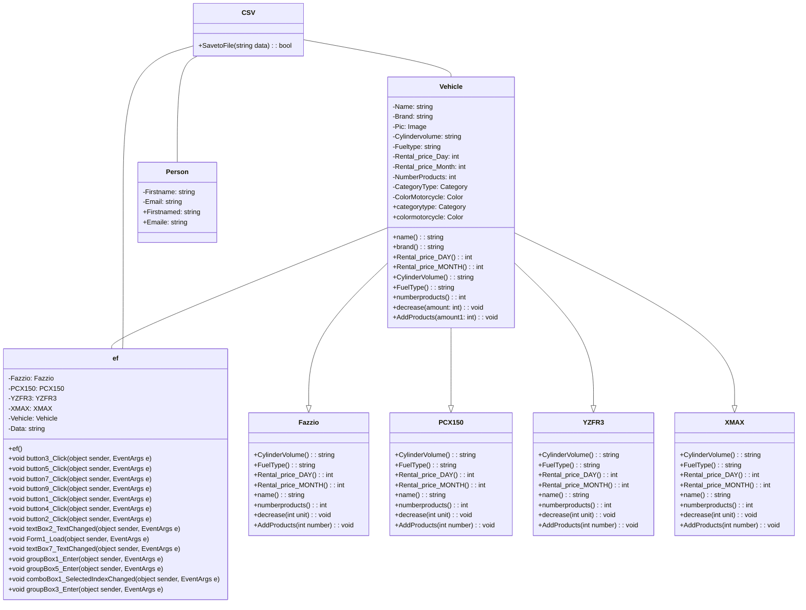

1.ความเป็นมาของโปรแกม
โปรแกรมเช่ารถมอเตอร์ไซค์สำหรับคนต่างชาติ เกิดขึ้นเพื่อตอบสนองความต้องการของนักท่องเที่ยวและผู้พำนักระยะสั้น ที่ต้องการความสะดวกในการเดินทาง

2.วัตถุประสงค์ของโปรแกรมเช่ารถมอเตอร์ไซค์

1. เพิ่มความสะดวกในการเดินทาง
ตอบโจทย์ความต้องการของนักท่องเที่ยวและผู้พำนักระยะสั้น ที่ต้องการความสะดวกในการเดินทาง
ขจัดอุปสรรคด้านภาษา เอกสาร และความปลอดภัย

2. ส่งเสริมการท่องเที่ยว
ดึงดูดนักท่องเที่ยวให้มาเที่ยวประเทศไทยมากขึ้น
กระตุ้นเศรษฐกิจท้องถิ่น

3. เพิ่มตัวเลือกในการเดินทาง
เป็นทางเลือกใหม่สำหรับผู้ใช้รถมอเตอร์ไซค์
ตอบสนองความต้องการที่หลากหลาย

class diagram

